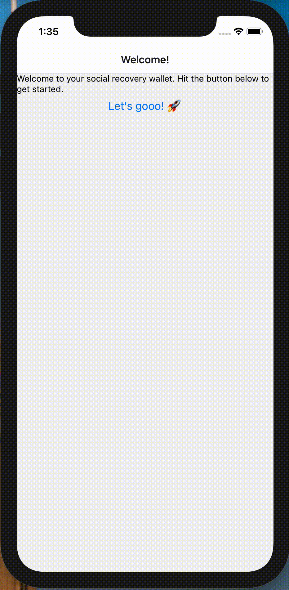

# 🚧👷🏽‍♀️Under construction👷🏽‍♀️🚧

# A Mobile Social Recovery Wallet
An attempt at a social recovery wallet. This is still very much a WIP

## How to run
Follow these instructions to ensure your dev environment is setup properly: https://reactnative.dev/docs/environment-setup

Check out the project and run

 `npm install`

Then in a separate terminal navigate to the project dir and run

`npx react-native start`

Then in the original terminal run

`npx react-native run-ios` or `npx react-native run-android` (I haven't actually tried it with Android yet 😅)

For ios you'll also need to do

```
cd ios
pod install
```

## How to test
To test the contract code run:

`npx truffle test` or `yarn truffle test`

# Current status
Currently this has basic wallet functionality. This will change in the future to actually be a social recovery wallet implemented on a L2.

## Setup



## Basic Functionality


